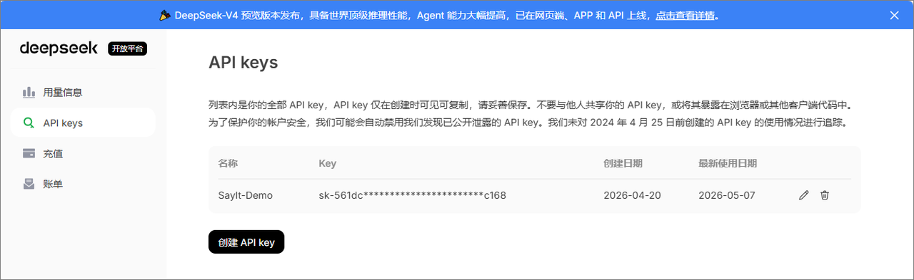
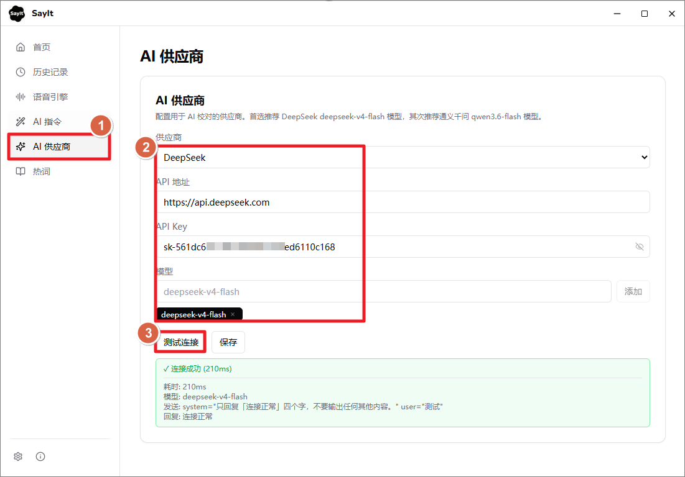
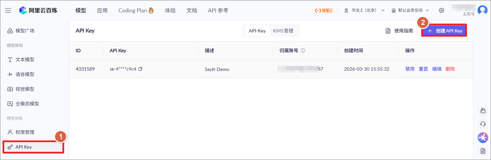

# SayIt AI 润色供应商配置

SayIt 有两个核心功能：将语言转录为文本（ASR）以及利用 AI 对文本进行润色。ASR 部分可以参考[SayIt 语音识别配置](https://my.feishu.cn/wiki/V4vLw2UfDiWcATkK2dyckhvynzc)。

AI 润色功能可以去除口癖词（嗯、啊、那个）、修正语音识别错误、翻译、自动分段排版等，都可以通过 Prompt 自定义控制。

SayIt 已对接国内常用的 AI 服务商（通义千问、DeepSeek、豆包等），同时支持 OpenAI 兼容格式，可以接入其他供应商或第三方中转服务商。

## 1. 推荐方案

AI 润色模型推荐使用 **deepseek-v4-flash** 质量好、价格低、速度可接受。

如果对延迟极度敏感（需要 <500ms），可以用通义千问 qwen3.6-flash，速度最快但准确度稍微差点。

| 供应商       | 模型              | 短文本 | 长文本（~200字） | 输入价格         | 输出价格          |
| ------------ | ----------------- | ------ | ---------------- | ---------------- | ----------------- |
| **DeepSeek** | deepseek-v4-flash | 803ms  | 2089ms           | 1 元/百万Token   | 2 元/百万Token    |
| 通义千问     | qwen3.6-flash     | 393ms  | 1308ms           | 1.8 元/百万Token | 10.8 元/百万Token |

## 2. 配置指南

AI 供应商建议直接使用官方 API。第三方中转站延迟普遍更高。

### DeepSeek（推荐）

- API 地址：`https://api.deepseek.com`
- 模型：`deepseek-v4-flash`
- 获取 API Key：[platform.deepseek.com](https://platform.deepseek.com/api_keys)

### 通义千问

- API 地址：`https://dashscope.aliyuncs.com/compatible-mode`
- 模型：`qwen3.6-flash`
- 获取 API Key：[百炼平台](https://bailian.console.aliyun.com/?spm=a2c4g.11186623.0.0.60905ec6iyaRqr&tab=model#/api-key)

## 3. 补充说明

**关于思考模式**

DeepSeek V4 Flash 默认开启 thinking 模式，会导致延迟飙升到 2~7 秒。SayIt 已自动关闭，无需用户配置。上表中的延迟数据是关闭思考后的结果。

**关于豆包 AI**

目前豆包的语音识别（ASR）是目前中文场景下最好的，SayIt 推荐使用豆包 ASR。但豆包的 AI 文本模型延迟极不稳定，不适合润色场景。建议 语音识别（ASR）用豆包，AI 润色用 DeepSeek。

**质量对比**

DeepSeek 和通义千问都能正确去口癖、识别列表结构、纠正专有名词大小写（DeepSeek、ChatGPT、OpenAI 等）。DeepSeek V4 Flash 在专有名词纠正和格式化方面更稳定，输出更简洁。