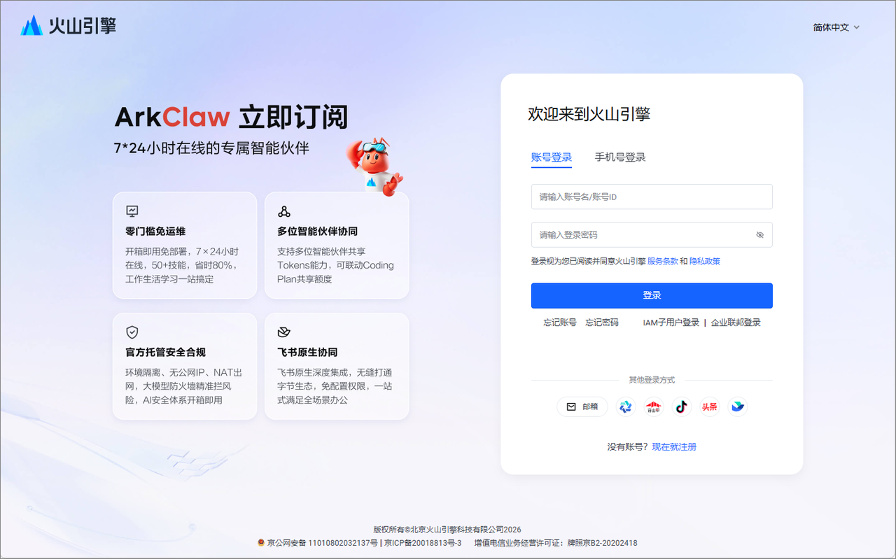
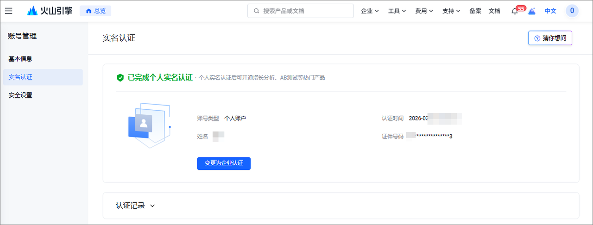
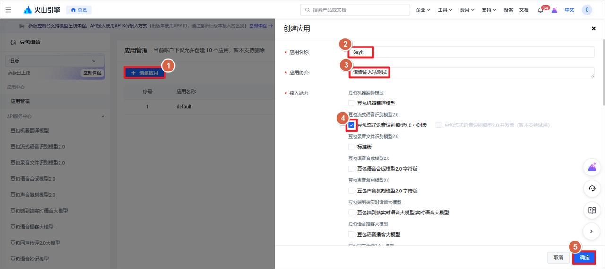
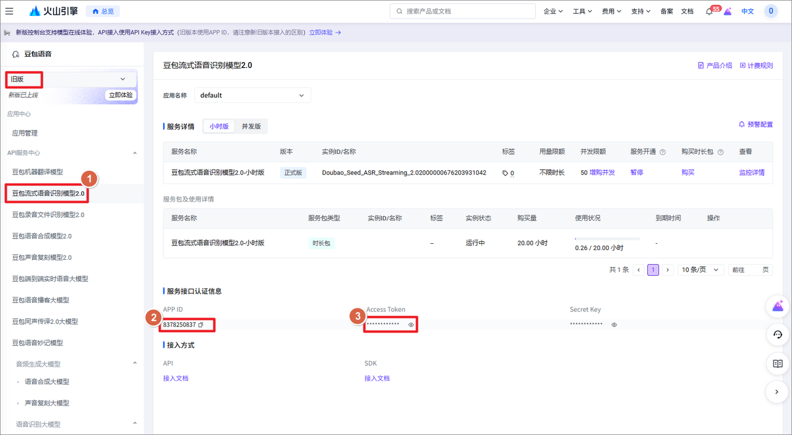
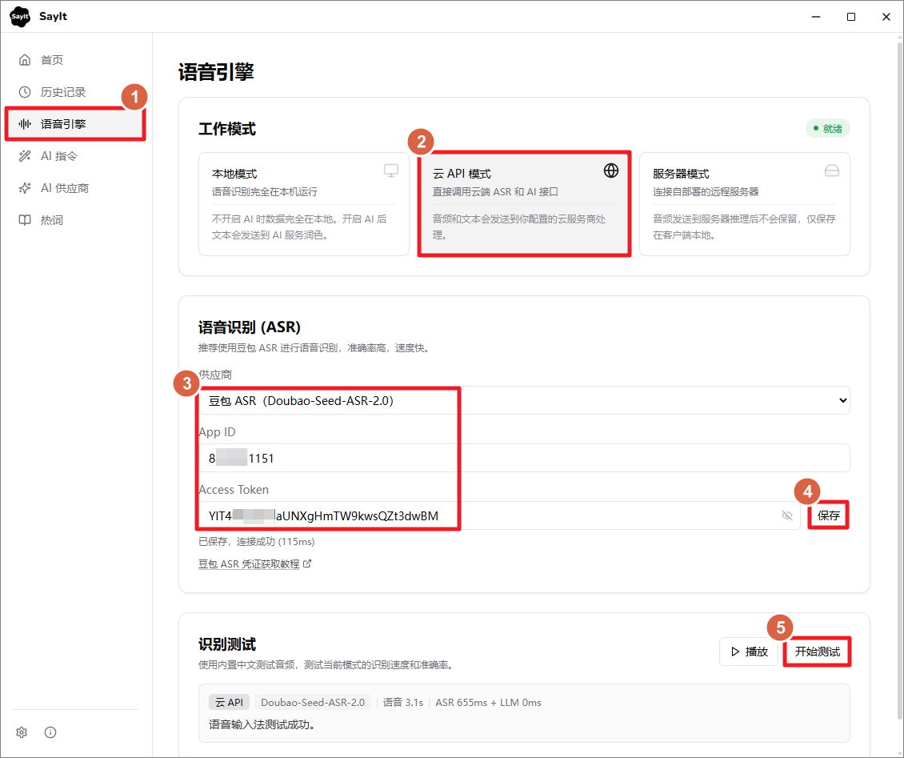

# SayIt 语音识别配置

SayIt 支持三种语音识别模式：

- **云端** **API**：调用云服务商的语音识别接口，准确率最高，适合大多数个人用户
- **本地推理**：使用本地模型离线识别，不需要网络，但准确率和速度不如云端
- **服务器模式**：自己部署后端服务，适合团队或有定制需求的场景

对个人用户来说，**云端** **API** **是最推荐的方式**，下面主要介绍这个模式。

## 1. 最佳实践

中文语音识别准确率最高的是**豆包流式语音识别 2.0**（Seed-ASR-2.0），其次是阿里的**千问** **ASR**（qwen3-asr-flash）。

SayIt 对豆包和千问 ASR 都做了流式优化——按住说话时，音频会实时发送给服务端，松手后只需要等待最后一小段音频的处理时间，通常几百毫秒就能拿到结果。

另外 SayIt 还支持**千问 3.5 Omni** 多模态模型，这类模型原生支持音频输入、文本输出，可以在转录的同时执行 Prompt 指令（比如去口癖、翻译等），相当于 ASR + AI 润色一步到位。

| 供应商       | 模型                     | 特点                     | 价格                    |
| ------------ | ------------------------ | ------------------------ | ----------------------- |
| **豆包**     | Seed-ASR-2.0             | 中文准确率最高，推荐首选 | 1.00 元/小时            |
| **阿里千问** | qwen3-asr-flash-realtime | 流式识别，速度极快       | 1.19 元/小时            |
| **阿里千问** | qwen3.5-omni-flash       | ASR + AI 一步到位        | 按 Token 计费（见下方） |

## 2. 使用豆包语音识别

SayIt 支持使用字节跳动「豆包流式语音识别模型 2.0」作为语音识别引擎。豆包 ASR 是目前中文语音识别准确率最高的模型，推荐使用。

1. 注册 / 登录火山引

打开[火山引擎语音服务控制台](https://console.volcengine.com/speech/service/10038)，用手机号注册或登录即可。已有账号的直接登录，没有账号会引导你先注册。

1. 完成实名认证

火山引擎的 API 服务需要先做实名认证，没认证的话后面创建应用会卡住。进入[实名认证页面](https://console.volcengine.com/user/authentication/detail/)，按页面提示走完就行。

1. 创建应用并获取 APP ID

进入[应用管理页面](https://console.volcengine.com/speech/app1)，点击「创建应用」。填写应用名称和简介（随便写就行），关键一步：一定要勾选「豆包流式语音识别模型 2.0 小时版」，不然后面用不了。

1. 获取APP ID 和 Access Token

进入 [API 服务中心页面](https://console.volcengine.com/speech/service/10038)，点击「豆包流式语音识别模型2.0」（配图是旧版界面）。页面上会显示你的 APP ID，鼠标放到 Access Token 上面，点击小眼睛图标，可以看到 Access Token 信息。

记录下来这两个信息填到 SayIt 软件中。选择 语音引擎 - 云 API 模式 - 选择ASR供应商为豆包 ASR，填写凭证信息后可以保存测试。

豆包开通试用后，半年内有 20 小时的[免费额度](https://www.volcengine.com/docs/6561/1359369?lang=zh)。超出免费额度后，按量计费：豆包流式语音识别模型 2.0 — 1 元/小时。[后付费价格详情](https://www.volcengine.com/docs/6561/1359370?lang=zh)

## 3. 阿里千问 ASR

阿里百炼平台提供了两个语音识别模型，都可以在 SayIt 中使用。

**qwen3-asr-flash / qwen3-asr-flash-realtime**

纯语音识别模型，中文准确率仅次于豆包。有两个版本：

- **qwen3-asr-flash**：非流式，录完再发，速度也很快
- **qwen3-asr-flash-realtime**：流式，边录边发，松手后几乎立刻出结果，体验极佳

两者准确率一样，推荐使用流式版本。适合搭配独立的 AI 润色供应商使用（比如通义千问或 DeepSeek 做文本校对）。

**qwen3.5-omni-flash**

多模态模型，可以直接接收音频输入并输出文本。和普通 ASR + AI 润色的两步流程不同，Omni 模型一步完成，可以在 System Prompt 中直接控制输出格式（比如去口癖、翻译、列表排版等）。

适合不想分别配置 ASR 和 AI 润色的用户，配置更简单。

**配置方式**

在 SayIt 设置中选择千问 ASR 系列，需要填写 API Key。

- 获取 API Key：[阿里百炼平台](https://bailian.console.aliyun.com/cn-beijing?tab=model#/api-key)

## 4. 价格

下面是各个模型按需使用的价格参考。

| 模型                                  | 价格            | 免费额度               |
| ------------------------------------- | --------------- | ---------------------- |
| 豆包 Seed-ASR-2.0                     | 1.00 元/小时    | 20 小时（半年内）      |
| 千问 qwen3-asr-flash（非流式）        | 0.79 元/小时    | 10 小时（90天内）      |
| 千问 qwen3-asr-flash-realtime（流式） | 1.19 元/小时    | 10 小时（90天内）      |
| 千问 qwen3.5-omni-flash               | 约 2.3 元/小时* | 100 万 Token（90天内） |

*Omni 按 Token 计费（每秒音频 ≈ 25 token），2.3 元为粗略估算。详见[千问价格文档](https://help.aliyun.com/zh/model-studio/model-pricing#95f0464a10q5c)。